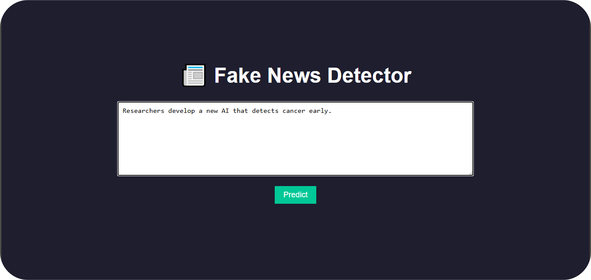
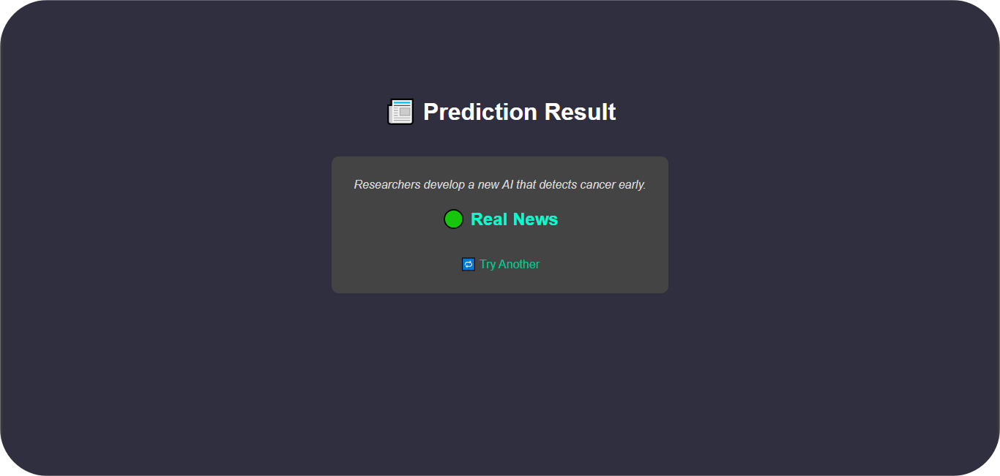

📰 Fake News Detector using Python, Flask, and Machine Learning

A simple web-based fake news detection system that uses Natural Language Processing and Machine Learning to classify news as **Real** or **Fake**.

🔍 Features

- Input any news statement and detect if it's **Real** or **Fake**
- Built with:
  - Python 🐍
  - Flask 🌐
  - scikit-learn 🤖
  - TF-IDF Vectorizer + Passive Aggressive Classifier
- Easy-to-use web interface

1. Train the model
   python train_model.py
2. Run the Flask app
   python app.py
3. Then open in browser:
👉 http://127.0.0.1:5000

📸 Screenshots

🏠 Home Page

✅ Prediction Result

